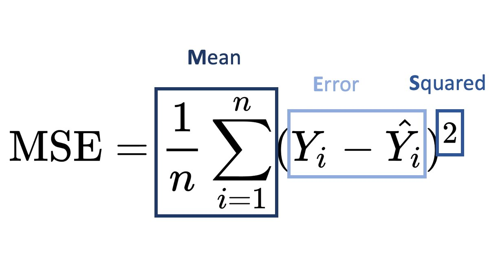

# Implement 1-3-1 Neural Network Using Matlab

Implement a 1-3-1 network with bias by means of batch backpropagation

## NO BUILD IN FUNCTION!! NO Pytorch, TensorFlow

## Parameter
### + Activation Function - sigmoid

### + Loss Function - MSE

## Result
### + Trained weight & bias

### + Loss and Accuracy
